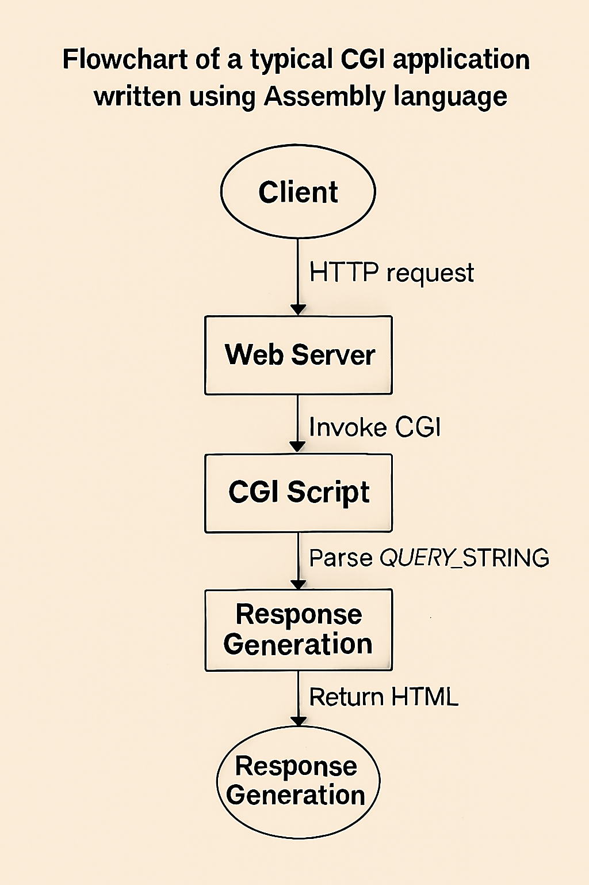
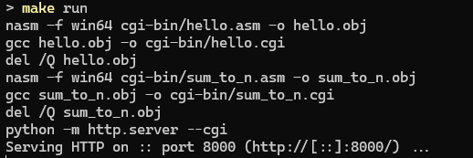
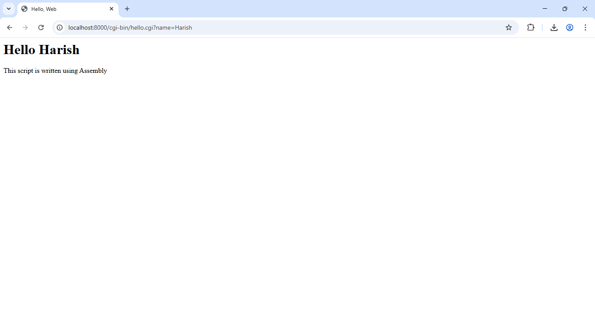
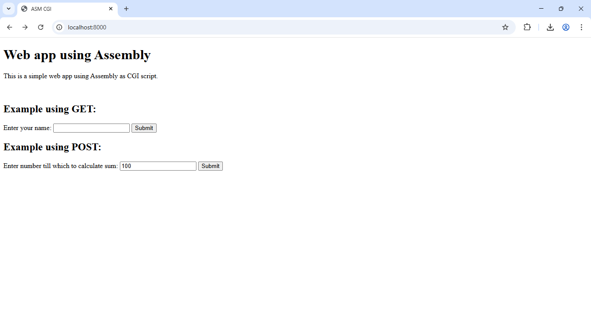
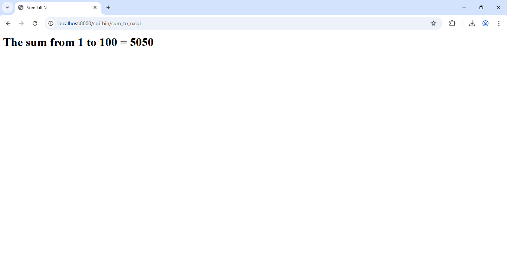

Development of web applications has almost become a trivial task. Modern frameworks like Rails can scaffold a complete application in minutes, and with AI assistance, even beginners can build functional sites. But this convenience comes with a trade-off: we rarely think about what's happening beneath the abstraction layers.

What if we stripped away all those layers? What if we built a web application using nothing but raw **x64 Assembly**? This tutorial guides you in building a minimal, complete web application that computes the sum of first `n` natural numbers.

## Why Assembly?

Most web applications today use Python, NodeJS, Java, C#, PHP, or Ruby, which provide a plethora of
functionalities built-in that makes webdev easier. But it comes at a cost --- by hiding a lot of internal
workings, such as System Calls, Memory Management, etc... that are crucial to understand the performance of the web application.

Assembly language isn't as scary as it seems! In fact, it helps one to understand how the computer 
works internally. So, I made this project, as a Proof of concept, to demonstrate how one can write web
applications in (virtually) any programming language.

This project uses **CGI protocol** to create the web app.

## What is CGI?

CGI (Common Gateway Interface) is one of the oldest and simplest protocols that enables dynamic, server-side controlled web applications. It works as follows:

- **Request from user:** The User makes a request to the CGI script (e.g., `http://example.com/cgi-bin/hello.cgi`) on the web server. The web server, when configured properly, recognizes it as a CGI request (typically by the `/cgi-bin/` path or `.cgi` extension)

- **The server runs the script:** The web server, based on the information from the HTTP request (query parameters, headers, method, etc...) runs the actual target script and provide those information via:
    - **Environment variables** (such as `QUERY_STRING`, `CONTENT_LENGTH`, etc...)
    - **Standard input** (stdin) for POST data

- The output of the executed program is collected and given as the response for the request



So, this workflow shows us that any programming language that supports reading of **environment variables**, and **basic I/O** can be used to write web application.

## Prerequisites

To make this Web app, you'll need the following:

- A Windows machine (this can be adapted to run on Linux, too.)
- An assembler (we'll use **NASM**)
- **GCC** (for stdlib functions)
- **Python** (< 3.15, for CGI server)
- **make**, for building the code

Note that I'm using the NASM assembler, since it is a widely used flavour of assembly. But this can be written in any assembler.

Python is required to host up the CGI scripts. The built-in web server of python supports it via the `--cgi` flag. You're free to use any web server (like Apache, NGNIX, etc...) that has support for CGI scripts.

This tutorial assumes the reader to have basic knowledge on HTML, Assembly language instructions and C standard library functions.

## Setup

Start the project by creating a folder under your projects directory. Note that the `>` symbol in the following snippets denotes the command prompt, and do not include it while typing it out at your terminal.

```cmd
> mkdir asm-cgi
> cd asm-cgi
```

We would also require a `cgi-bin` directory, for the web server to recognize CGI scripts.

```cmd
> mkdir cgi-bin
```

We'll be using a `Makefile` to simplify the build process.

```make
ASM = nasm
ASMFLAGS = -f win64
CC = gcc
CFLAGS = 
SRC_DIR = cgi-bin
OUT_DIR = cgi-bin

ASM_FILES := $(wildcard $(SRC_DIR)/*.asm)
CGI_FILES := $(ASM_FILES:$(SRC_DIR)/%.asm=$(OUT_DIR)/%.cgi)
OBJ_FILES := $(ASM_FILES:$(SRC_DIR)/%.asm=%.obj)

all: $(CGI_FILES)

$(OUT_DIR)/%.cgi: $(SRC_DIR)/%.asm
	$(ASM) $(ASMFLAGS) $< -o $*.obj
	$(CC) $*.obj -o $@
	del /Q $*.obj

clean:
	del /Q $(SRC_DIR)\*.obj $(OUT_DIR)\*.cgi

run: all
	python -m http.server --cgi

.PHONY: all clean
```

## Creating the interface

Let's start by creating a simple form to get inputs and pass to the CGI script. Create `index.html` in the root folder of project.

```html {filename=index.html}
<!DOCTYPE html>
<html lang="en">
    <head>
        <title>ASM CGI</title>
    </head>
    <body>
        <h1>Web app using Assembly</h1>
        <p>This is a simple web app using Assembly as CGI script.</p>
        <br>
        <h2>Example using GET:</h2>
        <form action="/cgi-bin/hello.cgi" method="get">
            <label for="name">Enter your name:</label>
            <input type="text" id="name" name="name">
            <input type="submit" value="Submit">
        </form>
    </body>
</html>
```

This is fairly a simple HTML form, but it uses GET method to send the request to the server. A Typical request made to the server looks like

```URL
http://localhost:8000/cgi-bin/hello.cgi?name=<Your Name>
```

where `<Your Name>` refers to the name that you've given as input in the form.

The CGI script will be called with an Environment Variable, named `QUERY_STRING` and it will contain the string `"name=<Your Name>"`

## Creating our Assembly Language Template

Let's start writing the CGI script in assembly. Create `hello.asm` under the `cgi-bin` directory:

```nasm {filename=hello.asm}
		bits 64
		global main
		extern printf, getenv, sscanf

		section .data
respHdr		db	`Content-type: text/html\n\n`, 0
htmlTemp	db	"<html><head>"
			db	"<title>Hello, Web</title>"
			db	"</head><body>"
			db	"<h1>Hello %s</h1>"
			db	"This script is written using Assembly</html>", 0
queryStr	db	"QUERY_STRING", 0
fmtStr		db	"name=%s", 0

		section .bss
name	    resb 32
```

We start by `extern`ing the required C Standard library functions and making our `main` function global. We also declare the necessary strings and variables in our program beforehand that has to be used.

The `"Content-type: text/html\n\n"` forms the HTML response header, and it is necessary for the client to recognize this as a proper HTML file. NASM allows C-Style escape sequences when strings are enclosed in *backticks*(`)

```nasm
		section .text
main:	sub rsp, 56

		; ... Main Program Logic goes here ...

        add rsp, 56

		xor rax, rax
		ret
```

This is our template for  `main` function. We start by subtracting 56 from `RSP` register (for allocating shadow space) as per requirements of Windows ABI(note that stack always grows downwards in x86_64). We deallocate it by add 56 to `RSP` and return from the function by setting `RAX` to zero.

## A Brief Detour: the Windows ABI

According to the Windows ABI specification, the first 4 integer (or pointer) arguments are passed onto registers
- `RCX`
- `RDX`
- `R8`
- `R9`

Further arguments are pushed onto the stack, in right-to-left order. The return value is placed in `RAX` register.

Let's say you want to make this equivalent C function call

```c
printf("Hello, %s! Your age is %d", name, age)
```
(Assuming variables `char* name` and `int age` exists)

You would need to call in assembly as follows:

```nasm
        section .data
fmt db  "Hello, %s! Your age is %d", 0

        section .text
main:   mov rcx, fmt  ; Pointer to Format string
        mov rdx, name ; Pointer to Name
        mov r8, [age] ; Value of age, from pointer age
        call printf
```

## Handling GET Requests

Now that we have idea about function calls in assembly, handling GET Requests look as follows:

```asm {filename=hello.asm, lineNos=true hl_lines=["4-21"]}
		section .text
main:	sub rsp, 56

        ; printf(respHdr)
		mov rcx, respHdr
		call printf

        ; RAX = getenv(queryStr)
		mov rcx, queryStr
		call getenv

        ; sscanf(RAX, fmtStr, name)
		mov rcx, rax
		mov rdx, fmtStr
		mov r8, name
		call sscanf

        ; printf(htmlTemp, name)
		mov rcx, htmlTemp
		mov rdx, name
		call printf

		add rsp, 56

		xor rax, rax
		ret
```

This just prints the HTTP Response Header, reads the name from the `QUERY_STRING` environment variable, and prints the predefined template.

## Handling POST requests

Using forms with `GET` requests are fine, but they pose a major problem, they echo the input in the URL. Sometimes, we may need to create forms whose actions are permanent and non-reversible and a suitable method for it is `POST`.

As per CGI specification, `POST` request data is placed in the `stdin` and the total length of the input data is placed in the `CONTENT_LENGTH` environment variable.

Let's try writing one. Create another file named `sum_to_n.asm` which gets a number via `POST` request and prints the sum of first `n` natural numbers.

```nasm {filename=sum_to_n.asm}
        bits 64
        default rel
        global main
        extern printf, getenv, sprintf, scanf, atoi

        section .data
respHdr     db  `Content-type: text/html\n\n`, 0
htmlTemp    db  "<html><head>"
            db  "<title>Sum Till N</title>"
            db  "</head><body>"
            db  "<h1>The sum from 1 to %d = %d</h1></body></html>", 0
clenStr     db  "CONTENT_LENGTH", 0
tempFmtStr  db  "n=%%%dd", 0

        section .bss
inputFmtStr resb 7
n           resq 1
```

As before, we `extern` some built-in functions and declare template strings along with a new, strange looking tempFmtStr variable (will be discussed in a minute).

We allocate 7 bytes for the inputFmtStr since the final generated format string looks as follows:

```c
"%<n>d", 0
```

The remaining 4 bytes are allocated for varying `<n>`.

```nasm {filename=sum_to_n.asm}
 		section .text
main:   sub rsp, 56

        mov rcx, respHdr
        call printf

        mov rcx, clenStr
        call getenv
```

Let's go over line by line:
- The first function call is for `printf` to print the response header.
- The second function call is for `getenv` to get the length of input (i.e., the `POST` request)

```nasm {filename=sum_to_n.asm}
		mov rcx, rax
        call atoi
        sub rax, 2
```
This function call is made to `atoi`, to convert the `CONTENT_LENGTH` value to a `int`. Since `RAX` contains the result of `getenv`, we use it directly. We subtract 2 from `RAX` to account for the fact that `stdin` contains the request as follows:

```stdin
n=<Your Input>
```
Where `<Your Input>` refers to the value of `n` submitted to the CGI script.

```nasm {filename=sum_to_n.asm}
        mov rcx, inputFmtStr
        mov rdx, tempFmtStr
        mov r8, rax
        call sprintf

		mov rcx, inputFmtStr
        mov rdx, n
        call scanf
```

Here comes the role of `tempFmtStr`. Unlike `printf`, `scanf` (or `sscanf`) doesn't support parametric passing of content length via `"*"` symbol. Hence, we use a template format string to generate the original format string that has to passed to scanf.

```nasm {filename=sum_to_n.asm}
        mov r8, [n]
        inc r8
        imul r8, [n]
        shr r8, 1
```

This is our main logic to calculate the sum of first `n` natural numbers. Instead of writing a manual loop, we use the mathematical formula:

$$ S_n = \frac{n(n+1)}{2} $$

Which is achieved via the `imul` instruction. Since the division is by 2 and by the rule, $n(n+1)$ is always divisible by 2 $\forall n \in \mathbb{N}$, we use the Shift Right(`shr`) operation by 1.

```nasm {filename=sum_to_n.asm}
        mov rcx, htmlTemp
        mov rdx, [n]
        ; r8 already has the sum
        call printf

        add rsp, 56

        xor rax, rax
        ret
```

Finally we print the values and exit successfully. Note that we stored our result in `R8` register intentionally so that an extra `mov` instruction isn't required at the time of function call.

For the server to handle the POST request, let's add another form to our `index.html`

```html {filename=index.html}
<!DOCTYPE html>
<!--Omitted for Brevity-->
		</form>

        <h2>Example using POST:</h2>
        <form action="cgi-bin/sum_to_n.cgi" method="post">
            <label for="str">Enter number till which to calculate sum:</label>
            <input type="text" id="n" name="n">
            <input type="submit" value="Submit">
        </form>
    </body>
</html>
```

## Running the Server

Let's compile the `.asm` files

```cmd
> nasm -f win64 cgi-bin/hello.asm -o hello.obj
> gcc hello.obj -o cgi-bin/hello.cgi
> del /Q hello.obj
> nasm -f win64 cgi-bin/sum_to_n.asm -o sum_to_n.obj
> gcc sum_to_n.obj -o cgi-bin/sum_to_n.cgi
> del /Q sum_to_n.obj
```

To run the web server, we'll use the python's built-in HTTP server.

```cmd
> python -m http.server --cgi
```

Note that you need to be outside the `cgi-bin` directory to access the CGI scripts. Try filling the first form to get greeting.

If you submit the second form, you'll get the result of sum. Here's the sample output that I got:






## Conclusion

With this, we've accomplished writing a minimal, yet functional web application using raw x64 Windows assembly. You can check out the source of this project [here](https://github.com/harishtpj/asm-cgi/tree/master). If you need to suggest any changes, feel free to create an [issue](https://github.com/harishtpj/asm-cgi/issues) at my repo.

Thanks for Reading!