Dijkstra's Algorithm is one of the popular and classic Graph algorithms taught in DSA. While it is
mainly implemented (now) in mainstream languages such as C, C++, Python, Java, etc..., it would be
a fun challenge to implement the same in one of the world's oldest programming languages. This
blog post guides you in the implementation of Dijkstra algorithm in Fortran, with no prior knowledge
of the language required

> [!NOTE]
> This tutorial assumes that the reader has basic programming knowledge in mainstream imperative
> languages, such as C or Python.

## An Introduction to Dijkstra's Algorithm

The [Dijkstra's Shortest Path finding Algorithm](https://en.wikipedia.org/wiki/Dijkstra%27s_algorithm) 
is used to find the shortest distance (and its corresponding) routes from a single source specified in a 
Graph. It has various uses in Networking, GPS and Navigation Systems, Map and Transportation planning, 
etc...

To understand how the algorithm works, let's trace through a sample graph manually:

> [!NOTE]
> You may skip this section, without any loss of content, if you already know the algorithm

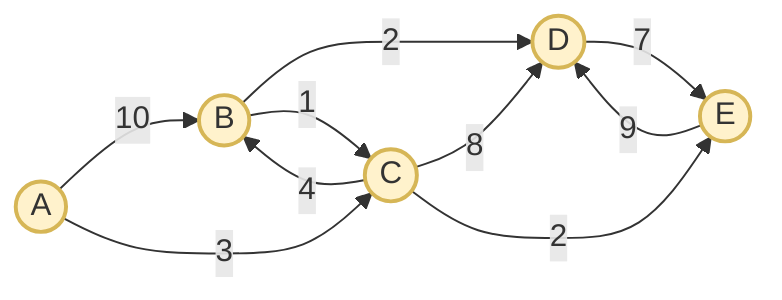

This is a simple 5 node weighted, directed graph. Our aim is to find the shortest distance from `A` to all
other nodes using this algorithm. To apply the algorithm, let's create a set `S` which contains the 
visited nodes and an array `Q` to store the vertices along with their distances. We also mention the 
current best minimum distance that we've achieved from node `A` to all other nodes.

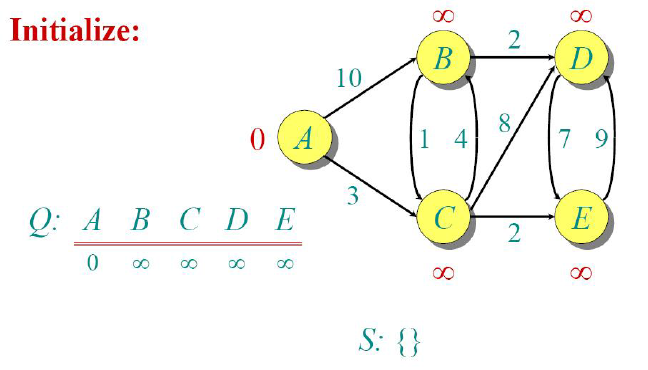

We can easily note down that at this stage, out of all other nodes, the distance to node `A` is the shortest (since it is the current node). Hence we could mark it as visited.

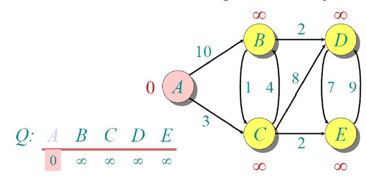

Since we mark node `A` to be visited, we now update the distances of all other nodes w.r.t `A`. Now the shortest distance from node `A` is `C` (3), so we move there.

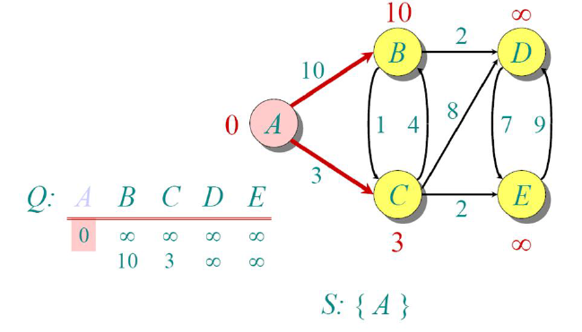

Since node `C` has the minimum distance among all the non-visited nodes, we mark it as visited, and
calculate the shortest distances to all other nodes w.r.t `C`.

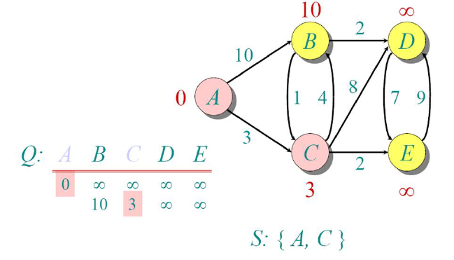

From node `C`, node `E` has the shortest distance, so we move there. Note that distances are 
cumulative from the source node `A`.

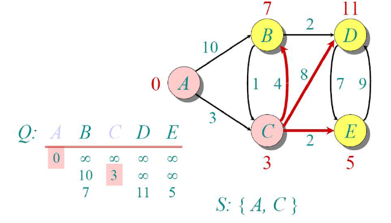

We now repeat the same process, and since node `E` has minimum among all non-visited nodes, we mark it 
as visited.

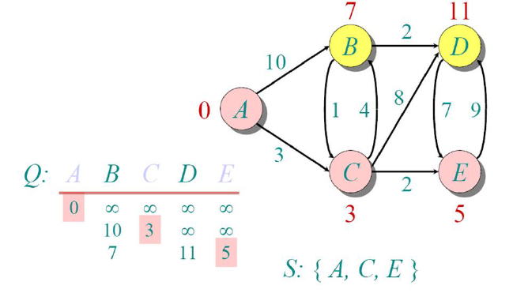

Now, if we try to update the distance from node `E` to all other non-visited nodes, no existing distances 
are improved. Hence we do not update any distances.

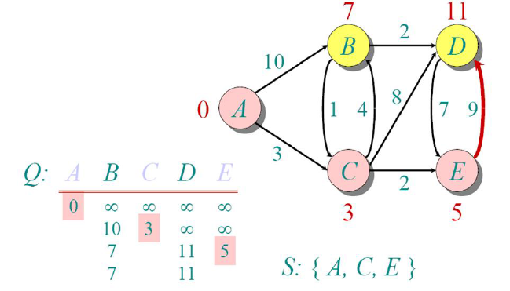

Since the minimum among the distances is node `B`, we select it as the next visited node.

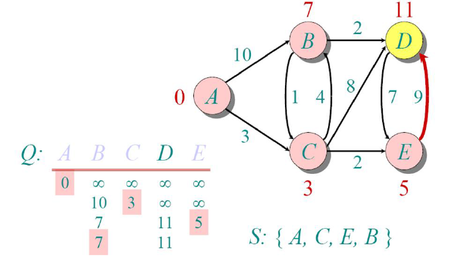

Now, we update the distances of all other non-visited nodes from there and see the minimum, and the
only option we're left with is node `D`

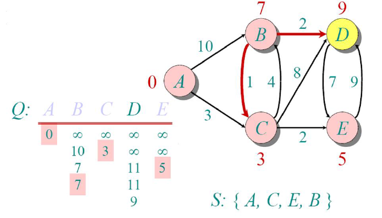

Finally, we mark that too visited and since we've completed visiting all the nodes, the algorithm ends.

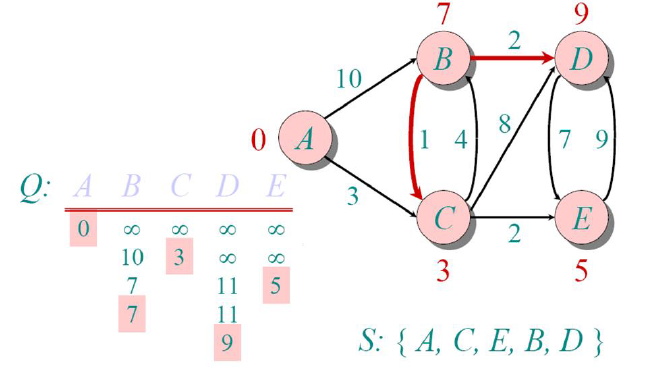

The distances shown above each node are the shortest distances to reach that node from our source node 
(`A`). To track the path, we just need to track the parent of each node (i.e., the node from which we 
last updated the shortest distance.).

Now equipped with the knowledge about the algorithm, let's implement it in Fortran.

## Implementation in Fortran

Using your favourite text editor, create a file named `dijkstra.f90` with the following contents:

```fortran {filename=dijkstra.f90}
program dijkstra
    implicit none
    integer :: n, src
    integer, allocatable :: graph(:, :), dist(:), parent(:)
```

Like C, C++ or Java, Fortran programs always have the skeleton of:

```fortran
program <name>
    ...
end program <name>
```

to denote the start and end of the program (much like `main()` in C), and unlike Java, it is not necessary
for the program name and filename to match. The `implicit none` is much like a compiler directive which
ensures that undeclared variable's datatype is not inferred from its first letter.

> [!NOTE]+
> In old Fortran, due to space constraints (each line was typed on punch cards), data type of variable
> were inferred from the first letter of their name. So names starting with `i`, `j`, .. `n` are 
> `integer`s and rest are `real` (equivalent to `double` in C)

To declare variables, we use `datatype :: name` format. In case of arrays, we specify the size alongside
the name in parentheses (e.g., `datatype :: name(<size>)`). To make it dynamic, we specify the
`allocatable` attribute, which marks that this array/matrix will be allocated later.

In our program, we declare variables to store no. of nodes(`n`), source node(`src`) and an adjacency
matrix representation of our graph (more on that below). We also have 2 arrays to store distances and 
parent nodes of each (to track the route).

```fortran {filename=dijkstra.f90}
    print '(a$)', 'Enter no. of nodes in graph: '
    read(*,*) n
    
    allocate(graph(n, n), dist(n), parent(n))
    call getEdges(graph)

    print '(a$)', 'Enter source node: '
    read(*, *) src
    call validateParams(n, src)

    call dijkstraAlgo(graph, src, dist, parent)
    call printDist(dist, src, parent)
contains
```

We now get the inputs for `n`, `graph`, `src` and validate the parameters (to prevent errors). We finally
end our program by running our dijkstra algorithm and printing the result. In our program, we've 
implemented them as subroutines (think of `void` functions in C).

> [!NOTE]
> The string that immediately follows `print`, `read` statement are much like format specifiers in C.
> `*` denotes that use the default stream and format for it in most cases.

Since we need to dynamically allocate the `graph` (and its associated arrays), we now `allocate` it
based on the no. of nodes.

## Inputting the Adjacency Matrix

The `getEdges` subroutine is implemented as follows:

```fortran {filename=dijkstra.f90}
subroutine getEdges(g)
    integer, intent(out) :: g(:, :)
    integer :: nEdges, i, u, v, w

    g = 0
    print '(a$)', 'Enter no. of edges: '
    read(*,*) nEdges

    do i = 1, nEdges
        print '(a,i0,a$)', 'Enter edge ', i, ' with weights: '
        read(*,*) u, v, w
        call validateParams(size(g, 1), u, v, w)
        g(u, v) = w
        g(v, u) = w
    end do
end subroutine getEdges
```

In Fortran, we specify the datatype of function parameters below the function's header 
(much like in pre ANSI-C). The `intent` attribute specifies the variable's access type, which lets the 
compiler enforce read-only (`in`), write-only (`out`), or read-write (`inout`) access to the parameter.
This roughly translates to Pass by value and Pass by reference semantics in most other languages.

In adjacency matrix representation of graph, we create a `n x n` matrix with each position denoting
the distance to move from node `i` to node `j`. It is initialized to 0. If at any position, the value is
non-zero, then it is understood that we have a connection between the nodes. To keep it simple, we
create it as an undirected graph, which means the connections are bidirectional.

We input the no. of edges and run a `do` loop (like C's `for` loop) to input the edges. The undirected
graph is constructed via the assignment `g(u, v) = w` and `g(v, u) = w`, which roughly translates to the
`g[u][v] = g[v][u] = w` 2D-array assignment of C/Python.

```fortran {filename=dijkstra.f90}
recursive subroutine validateParams(n, u, v, w)
    integer, intent(in) :: n, u
    integer, intent(in), optional :: v, w
    character(40) :: msg

    if (u < 1 .or. u > n) then
        write(msg, '(a,i0)') 'Nodes must be between 1 and ', n
        error stop trim(msg)
    end if

    if (present(v)) call validateParams(n, v)
    if (present(w)) then
        if (w < 0) error stop "Weights can't be negative!"
    end if
end subroutine validateParams
```

We also define another subroutine for validation purposes, which stops the program early if the inputs
aren't suited for our program. We ensure that nodes are numbered from 1 to `n` (In Fortran, arrays are
indexed from `1` unlike `0`-indexing in C) and weights aren't negative (since Dijkstra's algorithm
doesn't work on negative weights). We define this function recursively and declare the last 2 operands 
optional, so that the same function could be reused to validate multiple nodes.

Here we could see that we've replaced the default `*` in `write` statement, to provide our own stream
and format. The `error stop` statement enables early exits from our program.

## The Actual Algorithm

```fortran {filename=dijkstra.f90}
subroutine dijkstraAlgo(g, src, dist, parent)
    integer, intent(in) :: g(:, :), src
    integer, intent(out) :: dist(:), parent(:)
    logical, allocatable :: visited(:)
    integer :: n, i, u, v

    n = size(g, 1)
    allocate(visited(n))
    dist = huge(0)
    parent = -1
    visited = .false.

    dist(src) = 0
```

We start by creating a `visited` array (the `logical` datatype corresponds to Python's `bool`, with 
`.true.` => `True` and `.false.` => `False`). The `huge(0)` function call uses 0 merely as a type 
reference to tell Fortran we want the largest possible integer value and is equivalent to `INT_MAX` in C. 
Since Fortran is heavily optimized for array operations, all elements can be initialized with a single 
assignment.

We initialize `dist` array with ∞, `parent` array with -1 and `visited` array with `.false.`. Since we're
currently at node pointed by `src`, we make its distance 0.

```fortran {filename=dijkstra.f90}
    do i = 1, n
        u = minloc(dist, mask = .not. visited, dim = 1)
        visited(u) = .true.

        do v = 1, n
            if (g(u, v) /= 0 .and. .not. visited(v)) then
                if (dist(u) + g(u, v) < dist(v)) then
                    dist(v) = dist(u) + g(u, v)
                    parent(v) = u
                end if
            end if
        end do
    end do
end subroutine dijkstraAlgo
```

Now, we run a loop and extract the non-visited node with minimum distance. This is done by the `minloc`
function. The `mask` parameter filters out visited nodes, and `dim` parameter ensures that we get the 
index along the first dimension (because these functions are generalized to work with n-dimensional 
arrays), and mark it as `visited`

After extracting the minimum node, we iterate through the graph to check if it has an edge and update
distance only if it is minimum compared to current value. We also keep track of the previous node in the
`parent` array, whenever we update the distance.

## Printing the results

```fortran {filename=dijkstra.f90}
subroutine printDist(dist, src, parent)
    integer, intent(in) :: src, dist(:), parent(:)
    integer :: i

    print '(/a,i0,a)', 'Shortest routes from ', src, ':'
    do i = 1, size(dist)
        if (dist(i) == huge(0)) then
            print '(a,i0)', ' - No path to node ', i
            cycle
        end if
        
        print '(a,i0,a,i0,a$)', ' - to ', i, ' (distance = ', dist(i), '): '
        call printRoute(i, parent)
    end do
end subroutine printDist
```

To print the results, we iterate through the `dist` array and print an appropriate message if any value
still points to infinity (which implies that the node is disconnected from the rest of graph). The `cycle`
statement is the equivalent of `continue` in C/Python. Else we print the best minimum distance and call 
the `printRoute` subroutine which takes care of printing the route.

```fortran {filename=dijkstra.f90}
    subroutine printRoute(dest, parent)
        integer, intent(in) :: dest, parent(:)
        integer :: path(size(parent))
        integer :: cur, len, i

        len = 0
        cur = dest
        do while (cur /= -1)
            len = len + 1
            path(len) = cur
            cur = parent(cur)
        end do

        print '(*(i0, : " -> "))', (path(i), i = len, 1, -1)
    end subroutine printRoute
end program dijkstra
```

This subroutine takes care of backtracking. It starts from the destination, iterates backward until
it reaches the parent node (where value is -1), and prints the output array in reverse.

The `print` statement featured in the subroutine actually contains an implied `do` loop. The statement

```fortran
(path(i), i = len, 1, -1)
```

translates to the following list comprehension in Python.

```python
[path[i] for i in range(len, 1, -1)]
```

The format specifier `(*(i0, : " -> "))` states that repeat this format until arguments match (`*`), 
where each integer (`i0`, with variable length width) is separated with "->" and stop printing when list 
ends (`:`).

## Running the program

Since the original graph was directed, I've tested the program with another complex, undirected graph:

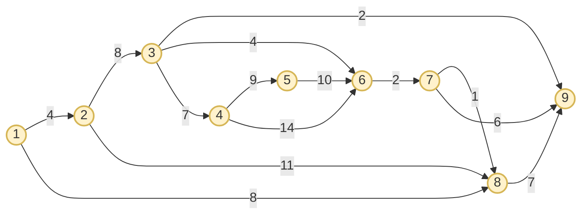

The output was as follows (on Windows CMD, replace `/` with `\`):
```bash
$ gfortran -o dijkstra dijkstra.f90
$ ./dijkstra
Enter no. of nodes in graph: 9
Enter no. of edges: 14
Enter edge 1 with weights: 1 2 4
Enter edge 2 with weights: 1 8 8
Enter edge 3 with weights: 2 8 11
Enter edge 4 with weights: 2 3 8
Enter edge 5 with weights: 3 9 2
Enter edge 6 with weights: 8 9 7
Enter edge 7 with weights: 9 7 6
Enter edge 8 with weights: 8 7 1
Enter edge 9 with weights: 7 6 2
Enter edge 10 with weights: 3 6 4
Enter edge 11 with weights: 4 6 14
Enter edge 12 with weights: 4 5 9
Enter edge 13 with weights: 6 5 10
Enter edge 14 with weights: 3 4 7
Enter source node: 1

Shortest routes from 1:
 - to 1 (distance = 0): 1
 - to 2 (distance = 4): 1 -> 2
 - to 3 (distance = 12): 1 -> 2 -> 3
 - to 4 (distance = 19): 1 -> 2 -> 3 -> 4
 - to 5 (distance = 21): 1 -> 8 -> 7 -> 6 -> 5
 - to 6 (distance = 11): 1 -> 8 -> 7 -> 6
 - to 7 (distance = 9): 1 -> 8 -> 7
 - to 8 (distance = 8): 1 -> 8
 - to 9 (distance = 14): 1 -> 2 -> 3 -> 9
 ```

## Conclusion

With this, we've accomplished implementing a classic Graph algorithm in Fortran. Personally, I feel that
despite the language itself being old, the implementation reads like something written in a modern 
high-level language, with fewer loops and succinct syntax.

The source code for this is available [here](https://github.com/harishtpj/Project-Unikode/blob/7d6f2ace28765c53b1f83e42bb1a0bbd4b48958f/39-dijkstra/dijkstra.f90).
I also maintain a larger project named [Project Unikode](https://github.com/harishtpj/Project-Unikode),
which has implementation of various short programs (in Rosetta code style) in all the programming 
languages I've learnt. Feel free to suggest any changes in this program (as well as on my ***Project 
Unikode***), by creating [issue](https://github.com/harishtpj/Project-Unikode/issues) at my repo.

Thanks for Reading!